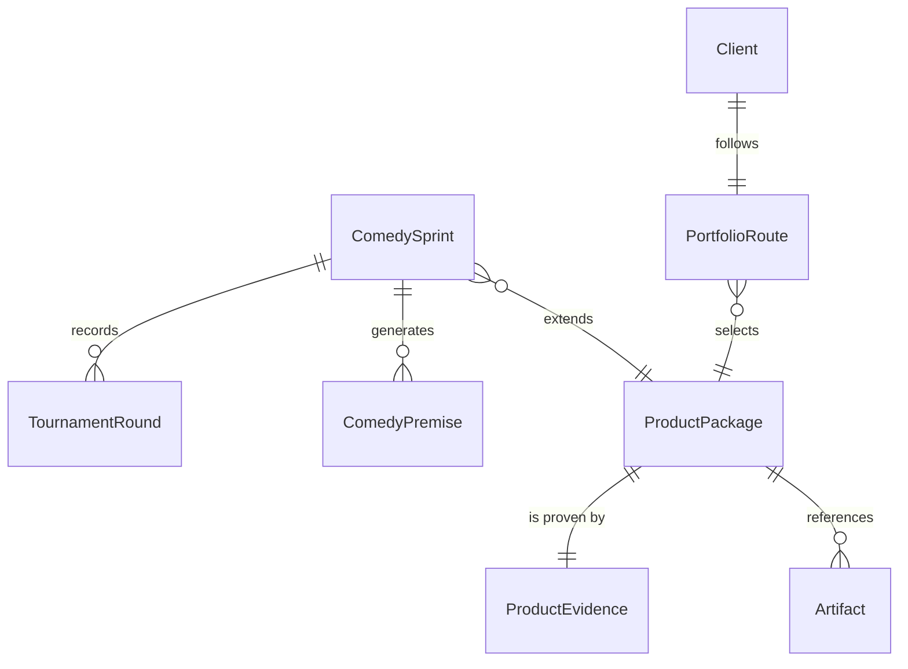

{/* Generated by `modelith render`. Do not edit by hand; edit the .modelith.yaml source and re-render. */}

# Jevmax Studio Product Portfolio

The commercial product layer for Jevmax Studio. A Client is routed through five reusable product packages. Each package must contain a reusable template, a manifest of real artifacts, measured cost evidence, QA evidence, and a portfolio summary. The comedy sprint extension models a high-volume premise pipeline whose paid rendering is gated behind two recorded judgment tournaments. The model exists to keep commercial routing, artifact verification, claim discipline, and paid-generation policy explicit.

## Glossary

- **`Client`** - A brand founder or marketing operator receiving a Jevmax Studio product.
- **`ComedyPersona`** - A distinct comedic perspective that generates premises independently before shared selection.
- **`Reviewer`** - A human or deterministic process that verifies portfolio completeness and evidence.
- **`StudioDirector`** - The Jevmax operator responsible for routing, production standards, and client approval gates.

## Enums

### `ApprovalStatus`

| Value | Definition |
| --- | --- |
| `NotRequested` | No paid or live-change approval has been requested. |
| `Approved` | The named client approved the exact scoped action. |
| `Rejected` | The named client rejected the action. |

### `ComedySprintStatus`

| Value | Definition |
| --- | --- |
| `Draft` | The comedy sprint is being generated or has not yet passed verification. |
| `Verified` | All premise, tournament, artifact, cost, QA, and claim checks passed. |
| `Retired` | The comedy sprint is no longer an active test. |

### `PackageStatus`

| Value | Definition |
| --- | --- |
| `Draft` | The product package is being authored and is not client-ready. |
| `DogfoodVerified` | The package has been exercised on internal evidence and passed deterministic portfolio checks. |
| `Retired` | The package is no longer offered. |

## Entities

### `Artifact`

A concrete repository output such as a scan report, character seed, V6 video, QA report, prompt, or cost report. An Artifact is evidence only after its path has been verified.

**Attributes**

| Name | Type | Description |
| --- | --- | --- |
| `role` | string |  |
| `path` | string |  |
| `verified` | boolean | _Derived:_ True after the portfolio validator resolves the artifact path successfully. |

**Actions**

- `verify` - actor `Reviewer`; preserves artifacts-exist, artifact-has-role - Resolve the artifact path and mark it Verified when present.

**Invariants**

- **artifact-has-role** - Every Artifact has a non-empty commercial or evidentiary role.

### `Client`

A brand or operator receiving Jevmax services. The Client supplies the commercial goal, product, destination, and any approval needed for paid deployment. A Client does not directly select render models or bypass portfolio gates.

**Relationships**

- `PortfolioRoute` - 1:1 - follows

**Attributes**

| Name | Type | Description |
| --- | --- | --- |
| `clientId` | string |  |
| `goal` | string |  |
| `paidActionApproval` | ApprovalStatus |  |

**Actions**

- `intake` - actor `StudioDirector`; preserves route-starts-from-client-question - Capture the client goal and current marketing state.
- `requestPaidActionApproval` - actor `StudioDirector`; preserves approval-before-paid-action, default-paid-generation-policy - Request exact approval for paid generation or live ad change.

**Invariants**

- **approval-before-paid-action** - A Client must have Approved paidActionApproval before paid generation outside the pre-approved GPT Image 2.5 or V6 route or any live ad change.

### `ComedyPremise`

One independently generated comedic premise, tagged by persona and linked to a concrete product tension. A premise may be filtered deterministically and later mutated, but its original text remains part of the recorded corpus.

**Attributes**

| Name | Type | Description |
| --- | --- | --- |
| `premiseId` | string |  |
| `persona` | string |  |
| `text` | string |  |
| `productTension` | string |  |
| `passedDeterministicFilter` | boolean |  |
| `mutatedFrom` | string |  |

**Actions**

- `filter` - actor `Reviewer`; preserves comedy-premise-unique, comedy-premise-product-link, deterministic-filter-first - Mark deterministic filter disposition without invoking Jev.
- `mutate` - actor `StudioDirector`; preserves comedy-premise-product-link, mutation-before-final - Create an escalated or sharpened revision while retaining persona and product tension.

**Invariants**

- **comedy-premise-text-bounded** - Every ComedyPremise remains short enough for a five-second vertical video.

### `ComedySprint`

A high-volume creative test that generates many premises from independent comedic personas, applies deterministic product/safety filters, records a first judgment tournament, mutates survivors, records a second tournament, and only then creates boards or paid video renders for finalists.

**Relationships**

- `ProductPackage` - n:1 - extends
- `ComedyPremise` - 1:n - owned - generates
- `TournamentRound` - 1:n - owned - records

**Attributes**

| Name | Type | Description |
| --- | --- | --- |
| `briefId` | string |  |
| `product` | string |  |
| `category` | string |  |
| `premiseTarget` | integer |  |
| `personaTarget` | integer |  |
| `survivorTarget` | integer |  |
| `finalistTarget` | integer |  |
| `maxV6Videos` | integer |  |
| `status` | ComedySprintStatus |  |

**Actions**

- `generate` - actor `StudioDirector`; preserves comedy-premise-quota, comedy-persona-coverage, comedy-premise-unique, comedy-premise-product-link, comedy-premise-text-bounded - Generate the premise corpus from independent comedic personas.
- `filter` - actor `Reviewer`; preserves deterministic-filter-first - Apply deterministic product, safety, duplication, and length filters before judgment.
- `runFirstTournament` - actor `Reviewer`; preserves tournament-evidence-recorded, tournament-usage-recorded, tournament-rationale-recorded - Record the first Jev selection tournament and select survivors.
- `mutate` - actor `StudioDirector`; preserves mutation-before-final - Escalate or sharpen each surviving premise before the second tournament.
- `runSecondTournament` - actor `Reviewer`; preserves tournament-evidence-recorded, tournament-usage-recorded, tournament-rationale-recorded, comedy-finalist-quota - Record the second Jev tournament and select finalists.
- `createBoards` - actor `StudioDirector`; preserves free-image-board-only - Create free GPT Image 2.5 boards for finalists.
- `renderVideos` - actor `StudioDirector`; preserves v6-two-video-cap, no-premium-comedy-video - Render at most two V6 720p no-audio videos from approved finalist boards.
- `verify` - actor `Reviewer`; preserves comedy-premise-quota, comedy-persona-coverage, deterministic-filter-first, tournament-evidence-recorded, comedy-finalist-quota, free-image-board-only, v6-two-video-cap, no-premium-comedy-video - Verify premise counts, persona coverage, filters, tournaments, artifacts, costs, QA, routes, policy, and claims.
- `retire` - actor `StudioDirector`; preserves complete-product-chain - Retire a verified comedy sprint from active testing.

**Invariants**

- **comedy-premise-quota** - A ComedySprint generates exactly 120 ComedyPremise records before filtering.
- **comedy-persona-coverage** - A ComedySprint uses six ComedyPersona values with 20 ComedyPremise records each.
- **comedy-premise-unique** - Every ComedyPremise has a unique premise id and unique normalized premise text.
- **comedy-premise-product-link** - Every ComedyPremise names a concrete product tension or use context rather than a generic joke.
- **deterministic-filter-first** - Deterministic product/safety filters run before the first Jev tournament.
- **mutation-before-final** - First-round survivors are mutated before the second tournament.
- **comedy-finalist-quota** - The second ComedySprint tournament selects exactly eight finalists.
- **free-image-board-only** - Comedy finalist boards use the currently free GPT Image 2.5 route only.
- **v6-two-video-cap** - A ComedySprint renders no more than two V6 videos.
- **no-premium-comedy-video** - A ComedySprint uses no MiniMax, Seedance, or other premium video route.

### `PortfolioRoute`

The deterministic path from a Client question to the correct product and then to the next product. The route prevents random creative production when intelligence, identity, launch preparation, or recurring measurement is missing.

**Relationships**

- `ProductPackage` - n:1 - selects

**Attributes**

| Name | Type | Description |
| --- | --- | --- |
| `entryQuestion` | string |  |
| `order` | integer |  |

**Actions**

- `route` - actor `PortfolioRoute`; preserves complete-product-chain, route-starts-from-client-question - Select the first product whose entry condition matches the client question.

**Invariants**

- **complete-product-chain** - The portfolio routes through Category Signal Audit, Brand Identity System, Creative Test Sprint, Paid Launch Kit, and Growth Loop in a closed chain.
- **route-starts-from-client-question** - Every PortfolioRoute begins with a concrete client question rather than a render request.

### `ProductEvidence`

The measured proof attached to a ProductPackage. It records credits, tokens where applicable, QA result, verification date, and limitations.

**Attributes**

| Name | Type | Description |
| --- | --- | --- |
| `measuredCost` | string |  |
| `qaStatus` | string |  |
| `verifiedOn` | string |  |
| `limitations` | string |  |

**Actions**

- `record` - actor `StudioDirector`; preserves evidence-has-cost, evidence-has-qa, package-dogfood-verified - Record measured cost, QA result, date, and limitations.

**Invariants**

- **evidence-has-cost** - Every ProductEvidence record states its measured credit and/or token basis.
- **evidence-has-qa** - Every ProductEvidence record states a QA result and its limitations.

### `ProductPackage`

A reusable commercial product such as the Category Signal Audit or Paid Launch Kit. A package is not complete because a document exists; it must pass artifact, evidence, cost, QA, routing, and claim checks.

**Relationships**

- `Artifact` - 1:n - owned - references
- `ProductEvidence` - 1:1 - owned - is proven by

**Attributes**

| Name | Type | Description |
| --- | --- | --- |
| `slug` | string |  |
| `routeOrder` | integer |  |
| `status` | PackageStatus |  |
| `templatePath` | string |  |
| `manifestPath` | string |  |
| `evidencePath` | string |  |
| `portfolioSummaryPath` | string |  |

**Actions**

- `author` - actor `StudioDirector`; preserves package-required-files - Create the reusable package structure.
- `verify` - actor `Reviewer`; preserves package-required-files, package-manifest-valid, artifacts-exist, no-unsupported-performance-claim - Run deterministic package, artifact, and claim checks.
- `retire` - actor `StudioDirector`; preserves complete-product-chain - Remove a package from the active route.

**Invariants**

- **package-required-files** - Every active ProductPackage has a reusable TEMPLATE.md, MANIFEST.json, EVIDENCE.md, and PORTFOLIO.md.
- **package-manifest-valid** - Every ProductPackage has a valid jevmax-studio-product-v1 manifest with product identity, route, artifacts, cost, QA, and policy.
- **artifacts-exist** - Every artifact path referenced by a ProductPackage exists in the repository.
- **package-dogfood-verified** - Every active ProductPackage has status DogfoodVerified and cites internal evidence.

### `TournamentRound`

An immutable record of one Jev judgment round, including input and output counts, model, token usage, scores, selection rationales, and artifact paths. It proves that selection happened before paid rendering.

**Attributes**

| Name | Type | Description |
| --- | --- | --- |
| `roundNumber` | integer |  |
| `inputCount` | integer |  |
| `outputCount` | integer |  |
| `model` | string |  |
| `inputTokens` | integer |  |
| `outputTokens` | integer |  |
| `scoresPath` | string |  |
| `rationalePath` | string |  |

**Actions**

- `record` - actor `Reviewer`; preserves tournament-evidence-recorded, tournament-usage-recorded, tournament-rationale-recorded - Persist scores, rationales, usage, and survivor selection for one round.

**Invariants**

- **tournament-evidence-recorded** - Every TournamentRound records its candidates, scores, output IDs, and artifact paths.
- **tournament-usage-recorded** - Every TournamentRound records input and output token usage.
- **tournament-rationale-recorded** - Every selectable TournamentRound candidate has a recorded judgment rationale category.

## Relationships

## Invariants

- **no-unsupported-performance-claim** - The portfolio shall not claim guaranteed ROAS, production lift, whole-library coverage, or percentage improvement without measured evidence.
- **default-paid-generation-policy** - Free GPT Image 2.5 boards and 40-credit V6 720p no-audio videos are the only pre-approved paid-media generation routes.

## Scenarios

### Complete five-product route

**Actors:** Client, StudioDirector

**Steps**

1. A Client asks what competitors are running; the `PortfolioRoute` selects Category Signal Audit.
2. The StudioDirector routes through `ProductPackage` instances for Brand Identity System and Creative Test Sprint.
3. A selected creative candidate reaches Paid Launch Kit.
4. After client approval, Growth Loop schedules recurring scans and refreshes.

**Invariants touched**

- **complete-product-chain** - The portfolio routes through Category Signal Audit, Brand Identity System, Creative Test Sprint, Paid Launch Kit, and Growth Loop in a closed chain.
- **route-starts-from-client-question** - Every PortfolioRoute begins with a concrete client question rather than a render request.

### Package verification catches a missing artifact

**Actors:** Reviewer

**Steps**

1. A `ProductPackage` references an `Artifact` path that does not exist.
2. The Reviewer runs `ProductPackage` verify.
3. The package remains non-client-ready until the missing path is repaired.

**Invariants touched**

- **package-required-files** - Every active ProductPackage has a reusable TEMPLATE.md, MANIFEST.json, EVIDENCE.md, and PORTFOLIO.md.
- **package-manifest-valid** - Every ProductPackage has a valid jevmax-studio-product-v1 manifest with product identity, route, artifacts, cost, QA, and policy.
- **artifacts-exist** - Every artifact path referenced by a ProductPackage exists in the repository.

### Premium generation requires explicit approval

**Actors:** Client, StudioDirector

**Steps**

1. A Client requests a premium video route outside V6.
2. The StudioDirector requests exact paidActionApproval.
3. No premium task is submitted while approval is NotRequested.

**Invariants touched**

- **approval-before-paid-action** - A Client must have Approved paidActionApproval before paid generation outside the pre-approved GPT Image 2.5 or V6 route or any live ad change.
- **default-paid-generation-policy** - Free GPT Image 2.5 boards and 40-credit V6 720p no-audio videos are the only pre-approved paid-media generation routes.

### Claim discipline blocks unsupported performance language

**Actors:** Reviewer

**Steps**

1. A `ProductPackage` portfolio summary proposes guaranteed ROAS.
2. The Reviewer rejects the unsupported claim.
3. The `ProductPackage` is not marked DogfoodVerified until claim language and `ProductEvidence` are corrected.

**Invariants touched**

- **no-unsupported-performance-claim** - The portfolio shall not claim guaranteed ROAS, production lift, whole-library coverage, or percentage improvement without measured evidence.
- **package-dogfood-verified** - Every active ProductPackage has status DogfoodVerified and cites internal evidence.

### Comedy sprint narrows many premises before paid rendering

**Actors:** StudioDirector, Reviewer

**Steps**

1. A `ComedySprint` generates 120 `ComedyPremise` records across six `ComedyPersona` values.
2. The Reviewer applies deterministic filters and records the first `TournamentRound` to 24 survivors.
3. The StudioDirector mutates survivors and the Reviewer records a second `TournamentRound` to eight finalists.
4. Only finalists receive free image boards and at most two V6 videos.

**Invariants touched**

- **comedy-premise-quota** - A ComedySprint generates exactly 120 ComedyPremise records before filtering.
- **comedy-persona-coverage** - A ComedySprint uses six ComedyPersona values with 20 ComedyPremise records each.
- **deterministic-filter-first** - Deterministic product/safety filters run before the first Jev tournament.
- **tournament-evidence-recorded** - Every TournamentRound records its candidates, scores, output IDs, and artifact paths.
- **comedy-finalist-quota** - The second ComedySprint tournament selects exactly eight finalists.
- **free-image-board-only** - Comedy finalist boards use the currently free GPT Image 2.5 route only.
- **v6-two-video-cap** - A ComedySprint renders no more than two V6 videos.
- **no-premium-comedy-video** - A ComedySprint uses no MiniMax, Seedance, or other premium video route.

### Comedy sprint rejects a weak or unsafe premise before Jev

**Actors:** Reviewer

**Steps**

1. A `ComedyPremise` lacks a concrete product tension or violates claim safety.
2. The Reviewer filters it deterministically before any `TournamentRound` scoring.
3. The filtered premise remains recorded but cannot enter the first tournament.

**Invariants touched**

- **comedy-premise-product-link** - Every ComedyPremise names a concrete product tension or use context rather than a generic joke.
- **deterministic-filter-first** - Deterministic product/safety filters run before the first Jev tournament.
- **comedy-premise-unique** - Every ComedyPremise has a unique premise id and unique normalized premise text.

