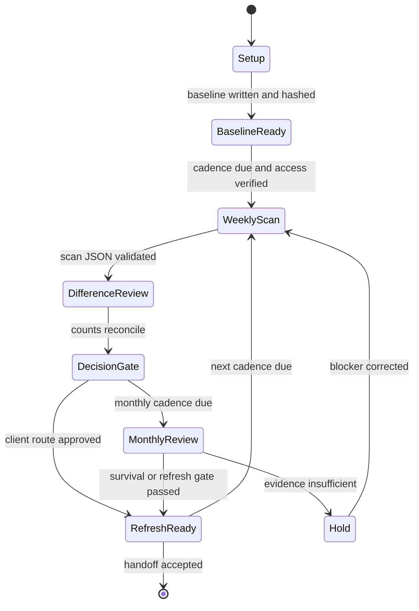

# Growth Loop production template

## Client setup

| Field | Client value |
|---|---|
| Client name | `[CLIENT_NAME]` |
| Category / search term | `[CATEGORY_AND_PRIMARY_SEARCH_TERM]` |
| Market | `[COUNTRY]` |
| Ad account | `[ACCOUNT_ID_OR_READ_ONLY_SCOPE]` |
| Baseline date | `[YYYY-MM-DD]` |
| Baseline snapshot | `[PATH_TO_UNIQUE_AD_ID_SNAPSHOT]` |
| Current date | `[YYYY-MM-DD]` |
| Operator | `[OPERATOR_NAME]` |
| Client approver | `[APPROVER_NAME]` |
| Confidentiality class | `[PUBLIC_INTERNAL_OR_CONFIDENTIAL]` |

## Product promise

The Growth Loop turns scattered advertising observations into a governed weekly
and monthly rhythm. It preserves bounded market samples, makes account state
visible, waits for a valid 60-day interval before making survival claims, and
routes only approved refresh work to the next product.

This is not an execution autopilot. It does not create, edit, pause, resume, or
delete ads, and it does not claim production performance lift.

## Scope

### In scope

- Weekly bounded competitive scan with a documented query plan.
- One dated, append-only snapshot of unique ad IDs per scan day.
- Difference review against the prior comparable sample.
- Read-only ad account readiness audit.
- Monthly review of sample stability, eligibility for a 60-day survival read,
  creative refresh needs, and the next product route.
- Explicit cost, QA, disclosure, and approval gates.

### Out of scope

- Whole-library census or unverifiable share-of-voice claims.
- Automatic ad-platform writes or paid deployment.
- Blind holdout claims or guaranteed ROAS / performance lift.
- Unapproved premium generation.
- Legal, financial, or platform-policy clearance.

## Required inputs

1. Frozen scan plan: search term, country, ad status, ad type, result limit,
   locale, and the reason each parameter is held constant.
2. Baseline snapshot containing unique ad IDs and a SHA-256 hash.
3. Prior weekly scan and difference report, when available.
4. Read-only account snapshot or an explicit blocker record.
5. Current creative inventory and its artifact manifest.
6. Client decision thresholds for refresh, hold, and escalation.
7. Approved generation policy and budget, if refresh work will generate assets.
8. Named client approver for any paid launch or live platform change.

## Operating state model

| Transition | Guard | Required evidence |
|---|---|---|
| Setup to BaselineReady | Snapshot is valid JSON, nonempty, and duplicate-free | Snapshot path, date, ID count, SHA-256 |
| BaselineReady to WeeklyScan | Scheduled cadence is due and read-only access works | Schedule record, timestamp, access status |
| WeeklyScan to DifferenceReview | Returned sample matches the frozen scan plan and parses | Raw response, result count, query parameters |
| DifferenceReview to DecisionGate | Added, retained, and missing ID counts reconcile | Difference JSON or table |
| DecisionGate to MonthlyReview | Four or more weekly observations or month boundary reached | Dated snapshot sequence |
| MonthlyReview to RefreshReady | Refresh hypothesis is supported and client approves route | Monthly decision record |
| Any state to Hold | Access, sample, schema, approval, or QA gate fails | Exact blocker and remediation owner |

## Weekly runbook

1. **Preflight:** confirm the frozen query plan, baseline date, schedule, and
   read-only access. Do not substitute a different term, market, status, type,
   or result limit without opening a new baseline.
2. **Collect:** run only the approved read-only competitive scan. Record the
   estimated total, number returned, timestamp, and any API or coverage warning.
3. **Snapshot:** extract unique ad IDs and merge them into
   `snapshots/YYYY-MM-DD.json`. Never overwrite an earlier snapshot.
4. **Validate:** confirm the snapshot parses, contains the expected unique ID
   count, has no duplicates, and record its SHA-256.
5. **Diff:** compare with the prior comparable sample. Report current-only,
   retained, and absent IDs. Treat absence from a bounded newest-first sample as
   absence from that sample, not as proof that an ad stopped running.
6. **Classify:** report advertiser, hook, and offer patterns only for the rows
   actually tagged. Keep untagged rows visible and do not extrapolate their
   labels to the full sample.
7. **Audit state:** if account access is approved, perform read-only checks for
   campaign state, tracking, placement readiness, and policy blockers. Make no
   account change.
8. **Route:** open a Creative Test Sprint brief only when the client approves a
   refresh hypothesis. Return to Category Signal Audit if the market definition
   changed. Stop at Paid Launch Kit only after launch disclosures and client
   approvals are complete.
9. **Record:** write a dated report, update the artifact manifest, and archive
   the exact input and output paths.

## Monthly review

1. Review the dated snapshot sequence and confirm the query plan stayed
   comparable. Do not compare samples with different markets or scan plans.
2. Calculate 60-day survival only when the current observation is at least 60
   days after the baseline. For a 2026-09-20 baseline, the first valid read is
   2026-11-19 or later.
3. Report survival as the share of baseline IDs observed in the current bounded
   sample, with the sampling limitation stated. Do not call bounded overlap
   performance, profitability, or whole-market survival.
4. Refresh the read-only account audit and list blockers by client impact.
5. Review creative fatigue and measurement signals only where actual data
   exists. Missing data is a blocker, not an assumption.
6. Choose one route: continue observing, run a bounded tagging pass with
   approved token budget, open a Creative Test Sprint, or hold for remediation.
7. Record the decision, dissents, cost, QA result, and next review date.

## Deliverables

| Output | Acceptance requirement |
|---|---|
| Weekly scan report | Query parameters, timestamp, estimated and returned counts, coverage warning, and read-only statement |
| Dated snapshot | Valid JSON, nonempty unique ID list, no duplicates, stable path, SHA-256 |
| Difference report | Added, retained, and absent ID counts reconcile to the input counts |
| Monthly growth review | Snapshot sequence, survival eligibility, audit result, refresh decision, and next route |
| Refresh brief | Bounded evidence summary, open questions, approval boundary, and Creative Test Sprint inputs |
| Updated manifest | Every linked artifact exists and measured cost / QA state is current |

## Cost and approval gates

- Default weekly loop generation cost: zero credits and zero new creative assets.
- Unattended scans do not tag every new ad. Approve a bounded tagging pass and
  its token estimate before scaling judgment calls.
- Free GPT Image 2.5 images may be used only under the current approved policy.
- A five-second V6 720p no-audio video may use the approved 40-credit route.
- Any other paid or premium generation requires explicit operator approval
  before the task is queued.
- No paid launch, campaign change, or ad-platform write occurs from this loop.
  Paid Launch Kit and explicit client approval own that boundary.
- Never copy credentials into reports, manifests, snapshots, or prompts.

## QA gates

| Gate | Fail condition | Required result |
|---|---|---|
| Snapshot parse | Invalid JSON | Valid JSON |
| Snapshot uniqueness | Duplicate ID | Unique ID list and explicit count |
| Snapshot integrity | Missing hash or changed baseline | SHA-256 recorded for every frozen snapshot |
| Scan shape | Missing count, timestamp, or query plan | Complete scan record |
| Diff arithmetic | Counts do not reconcile | Retained plus current-only equals current count |
| Sample honesty | Findings omit bounded-sample warning | Warning present in every competitive finding |
| Survival age | Fewer than 60 days between baseline and current read | Mark survival not yet valid |
| Automation safety | Prompt or execution attempts an ad write | Stop and escalate; read-only only |
| Manifest integrity | Broken or nonlocal path | Every path resolves from the product directory |
| Regression baseline | Offline suite below required pass rate | Current portfolio gate passes before delivery |

## Delivery checklist

- [ ] Client setup fields are complete.
- [ ] Scan plan is frozen and recorded.
- [ ] Baseline and current snapshots are hashed.
- [ ] Difference arithmetic is checked.
- [ ] Bounded-sample and no-survival-yet limitations are explicit.
- [ ] Read-only account audit is current or its blocker is recorded.
- [ ] Monthly decision and next route have named approvals.
- [ ] Generation, token, and API costs are recorded.
- [ ] All QA gates pass.
- [ ] Manifest paths and JSON validate.
- [ ] Confidentiality and disclosure requirements are met.

## Handoff

Normal next product: **Creative Test Sprint**.

Use Category Signal Audit instead when the category, market, or query plan needs
redefinition. Use Paid Launch Kit only after the client explicitly approves a
launch plan, disclosures, budget, and live changes outside this loop.
